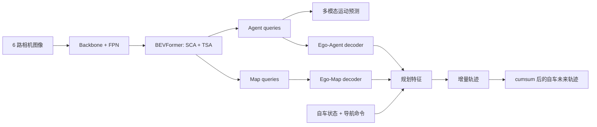

# VAD：从向量化场景到自车规划的公式推导

> 本文以 [VAD 论文](https://arxiv.org/abs/2303.12077) 和官方实现为准，重点解释 BEVFormer 之后发生了什么，以及训练约束与推理过程的区别。

## 1. 任务输出与张量

VAD 从多相机序列联合输出三类向量：

$$
\hat V_{map}\in\mathbb R^{N_m\times N_p\times2},
$$

$$
\hat V_{agent}\in\mathbb R^{N_a\times N_k\times T_f\times2},
$$

$$
\hat V_{ego}\in\mathbb R^{T_f\times2}.
$$

$N_m$ 是地图实例数，$N_p$ 是每条折线的点数，$N_a$ 是交通参与者数，$N_k$ 是多模态未来数，$T_f$ 是预测步数。实现中轨迹 head 预测的是相邻时刻位移 $\Delta p_t$，评估/显示时用

$$
p_t=\sum_{\tau=1}^{t}\Delta p_\tau \tag{1}
$$

恢复相对当前位置的轨迹。这就是源码中多处 `cumsum(dim=-2)` 的意义。

## 2. 从 BEV 到三类 query

BEVFormer 输出统一特征 $B_t$。随后 transformer decoder 维护：

- agent queries $Q_a$：检测目标，并预测多模态运动；
- map queries $Q_m$：预测车道分隔线、道路边界等折线；
- ego query $Q_{ego}$：汇聚自车状态与场景交互证据。

agent/map query 用集合预测与 Hungarian matching 消除固定输出槽位和真实实例之间的排列歧义。设匹配代价为分类、回归等项的加权和，最优分配为

$$
\hat\sigma=\arg\min_{\sigma\in\mathfrak S_N}
\sum_{i=1}^{N}\mathcal C(y_i,\hat y_{\sigma(i)}). \tag{2}
$$

这意味着 query 编号本身没有“第 7 个永远是前车”的语义。

## 3. Ego-Agent 交互

自车 query 先对有效 agent queries 做 transformer decoder：

$$
Q'_{ego}=\operatorname{Decoder}
(q=Q_{ego},k=Q_a,v=Q_a;
q_{pos}=PE_1(p_{ego}),k_{pos}=PE_1(p_a)). \tag{3}
$$

展开一个标准 cross-attention 头：

$$
\operatorname{Attn}(q,K,V)
=\operatorname{softmax}\left(
\frac{(qW_Q)(KW_K)^\top}{\sqrt d}+M
\right)VW_V. \tag{4}
$$

$M$ 屏蔽低置信度或无效 agent。位置编码使“同样外观但距离不同”的车辆对规划产生不同影响。

## 4. Ego-Map 交互

再让自车 query 读取地图折线：

$$
Q''_{ego}=\operatorname{Decoder}
(q=Q'_{ego},k=Q_m,v=Q_m;
q_{pos}=PE_2(p_{ego}),k_{pos}=PE_2(p_m)). \tag{5}
$$

先 agent、后 map 是一种结构化归纳偏置：先回答“谁会与我交互”，再回答“哪些几何边界与方向约束我”。官方实现中分别对应 `ego_agent_decoder` 和 `ego_map_decoder`。

## 5. 命令条件规划头

规划特征拼接 ego-agent 结果、ego-map 结果和自车状态 $s_{ego}$：

$$
f_{ego}=[Q'_{ego},Q''_{ego},s_{ego}]. \tag{6}
$$

给定高层命令 $c\in\{left,straight,right\}$，规划头输出

$$
\hat V_{ego}=\operatorname{PlanHead}(f_{ego},c). \tag{7}
$$

实现上 head 同时产生多个命令分支，`ego_fut_cmd` 是 one-hot 选择器。推理时只取对应分支，再按式 (1) 累积。不要把 command 当作网络自己预测的路线意图；它是上游导航提供的条件。

## 6. 监督损失

### 6.1 自车模仿损失

对有效时间掩码 $m_t$，实现使用加权 L1：

$$
\mathcal L_{imi}
=\frac{1}{\sum_t m_t}
\sum_{t=1}^{T_f}m_t
\lVert\Delta p_t-\Delta\hat p_t\rVert_1. \tag{8}
$$

论文简写为位置轨迹的平均 L1；阅读代码时必须辨认当前张量是增量还是累积坐标。

### 6.2 agent 多模态运动

对每个真实未来 $V_i$，先用终点误差选最接近的模态：

$$
k_i^*=\arg\min_k
\lVert p_{i,T_f}-\hat p_{i,k,T_f}\rVert_2. \tag{9}
$$

选中模态做轨迹回归，其余模态通过分类/focal loss 学习概率：

$$
\mathcal L_{mot}=\mathcal L_{traj}(k_i^*)
+\lambda_{mode}\mathcal L_{focal}(k_i^*). \tag{10}
$$

这比把所有模态都拉向同一真值更能保留左转/直行等多解性。

## 7. 三个显式规划约束

### 7.1 Ego-Agent 碰撞约束

令自车预测位置 $p^t_e$ 与第 $i$ 个 agent 预测位置 $p^t_i$ 的距离

$$
d_{a}^{it}=\lVert p_e^t-p_i^t\rVert_2.
$$

安全阈值为 $\delta_i$，hinge penalty：

$$
\ell_{col}^{it}=\max(0,\delta_i-d_a^{it}), \tag{11}
$$

$$
\mathcal L_{col}=\frac1{T_f}\sum_t\sum_i\ell_{col}^{it}. \tag{12}
$$

距离大于阈值时梯度为 0；进入安全区后，距离越小惩罚越大。

### 7.2 Ego-Boundary 边界约束

令 $d_{bd}^t$ 为自车点到最近道路边界折线的距离：

$$
\mathcal L_{bd}=\frac1{T_f}\sum_t
\max(0,\delta_{bd}-d_{bd}^t). \tag{13}
$$

实现会先筛选边界类 map queries，再计算点到折线的距离。若地图置信度过滤错误，约束可能完全失效或被错误折线主导。

### 7.3 Ego-Lane 方向约束

令最近车道中心线局部方向为 $v_l^t$，自车轨迹切向量为 $v_e^t=p_e^t-p_e^{t-1}$：

$$
\theta_t=\arccos
\frac{v_e^t\cdot v_l^t}
{\lVert v_e^t\rVert_2\lVert v_l^t\rVert_2+\epsilon}, \tag{14}
$$

$$
\mathcal L_{dir}=\frac1{T_f}\sum_t\theta_t. \tag{15}
$$

数值实现必须把余弦裁剪到 $[-1,1]$，且用 $\epsilon$ 处理零速度，否则 `acos` 容易产生 NaN。

## 8. 总目标与官方权重

论文总损失为

$$
\mathcal L=
\omega_1\mathcal L_{map}
+\omega_2\mathcal L_{mot}
+\omega_3\mathcal L_{col}
+\omega_4\mathcal L_{bd}
+\omega_5\mathcal L_{dir}
+\omega_6\mathcal L_{imi}. \tag{16}
$$

VAD-Tiny 官方配置中规划项的实现默认权重大致为：L1 `0.25`，boundary/collision/direction 各 `0.1`。这些值是配置事实，不应由论文公式中的符号顺序猜测。

一个关键边界：式 (11)–(15) 是**训练阶段损失**。官方推理不是“先枚举轨迹，再手写 collision cost 选最优”，而是直接输出由这些损失塑形过的命令条件轨迹。本仓库的教学 demo 使用显式候选打分，是为了看清闭环因果，不等同于 VAD 正式 planning head。

## 9. 一帧到一条轨迹的数据流

## 10. 源码定位与断点建议

- `VAD/VAD.py`：按 scene 管理 `prev_bev`，推理时选择命令分支并 `cumsum`；
- `VAD/VAD_head.py:729` 附近：ego-agent decoder；
- `VAD/VAD_head.py:756` 附近：ego-map decoder；
- `VAD/VAD_head.py:792` 附近：`ego_fut_decoder`；
- `VAD/VAD_head.py:1108` 附近：规划损失汇总；
- `VAD/utils/plan_loss.py`：boundary、collision、direction 的具体距离与掩码实现。

建议第一次单步时记录：agent/map 分类置信度、query 数量、每个命令分支形状、增量轨迹首两步、累积后的终点、各规划 loss 的有效元素数。

## 11. 读代码前必须回答

1. 为什么轨迹回归张量末维是 2，却仍需 `cumsum`？
2. `ego_fut_cmd` 是监督标签、上游输入，还是模型预测？
3. collision loss 为 0 能否证明场景一定安全？
4. 训练约束为什么能在推理阶段没有显式优化器时仍影响输出？

答案与更多题目见 [详细自测](04_self_test.md)。
