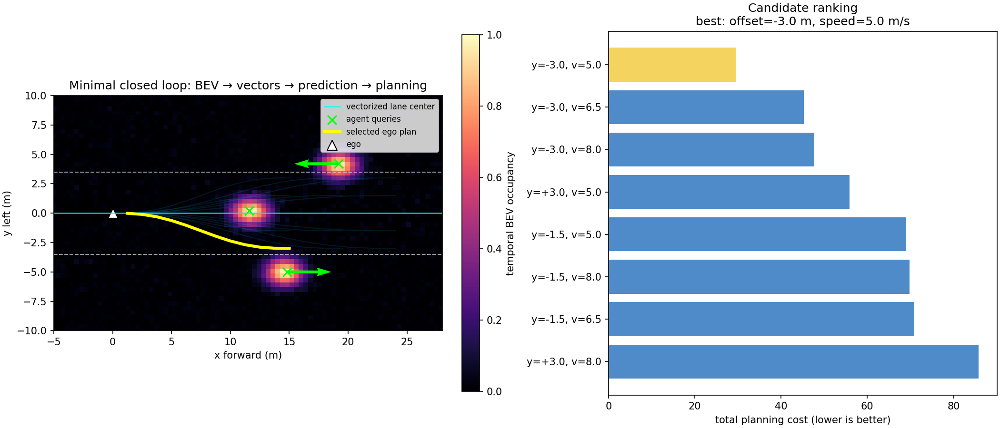
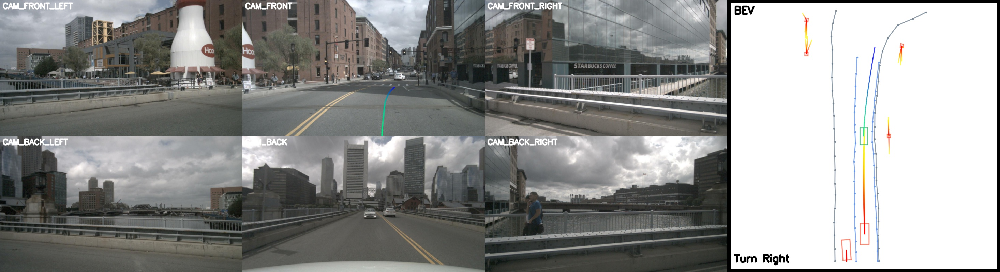

# 实验记录

> 本文件记录本仓库在目标机器上的实际结果。命令模板与论文数字分开写，避免把“预计能跑”包装成“已跑通”。

## 1. 硬件与主机

| 项目 | 实测 |
|---|---|
| OS | Windows 11 Pro，build 26200 |
| CPU | AMD Ryzen 9 9950X |
| RAM | 约 61.6 GiB |
| GPU | 2 × NVIDIA GeForce RTX 4090 D |
| 单卡显存 | 49,140 MiB（`nvidia-smi`） |
| NVIDIA driver | 591.86 |
| 项目盘初始可用 | 约 3.0 TB |

最终实测磁盘占用（GiB 按 Windows `1 GB = 2^30 bytes` 显示）：

| 目录 | GiB |
|---|---:|
| `data/`（已解压数据 + 生成标注） | 11.174 |
| `artifacts/`（压缩包、权重，含一次保留的坏包） | 9.323 |
| `_deps/` | 0.017 |
| `outputs/` | 0.012 |
| 项目目录合计 | 20.538 |
| `vad-study` Conda 环境 | 4.882 |
| 项目 + 环境合计 | **25.420** |

即使保留排错时的 4.17 GB 坏包也远低于 50 GB 上限；干净重跑通常更小。环境安装时还需给 Conda/pip 缓存和临时编译留余量，因此文档仍建议预留 40 GB。

## 2. 资产结果

| 资产 | 精确字节数 | 状态 |
|---|---:|---|
| nuScenes v1.0-mini | 4,168,148,189 | 已下载、`tar -tzf` 通过并解压 |
| CAN bus expansion | 780,974,697 | 已下载并解压 |
| Map expansion v1.3 | 398,535,531 | 已下载并解压 |
| VAD-Tiny checkpoint | 484,968,871 | 已完成 Range 续传、长度校验与 CPU 加载 |

首次下载的 SHA-256 记录：

```text
v1.0-mini.tgz                    e5d9c2b5ced29f9e3d39651e2093d27e892d0571f10962409974b21033a254ee
can_bus.zip                      3c68b94c001e8bd05a19886ecb2c6854e0cd69d7005ed9a94d13d45d2951e83f
nuScenes-map-expansion-v1.3.zip 9dbc80a095b6b28d9b79fc9a43471a750dc92ca78c6d0db288fd92b34be5a144
VAD_tiny.pth                     430e8881f33bdb19f86557db00c2ccc77da22b3bc042ba7f41a9ef4c2b258a16
```

Checkpoint 的 CPU 结构检查：顶层键为 `meta/state_dict/optimizer`，`state_dict` 含 746 个条目。此检查只对可信的官方下载执行。

nuScenes 官方 SDK 的实际加载结果：

```text
10 scene
404 sample
31206 sample_data
18538 sample_annotation
first scene: scene-0061, 39 samples
```

这验证了元数据、样本文件索引与地图根目录，而不只是检查目录是否存在。

## 3. 透明教学闭环结果

运行：

```powershell
conda run -n vad-study python demo/minimal_bevformer_vad.py `
  --self-test --save-gif --no-show
```

实际自测：

```text
PASS: 5/5 mathematical and closed-loop self-tests
```

场景输出：

```text
agent queries: [[14.8, -5.0], [11.6, 0.2], [19.2, 4.2]]
estimated velocities: [[0.8, 0.0], [0.0, 0.0], [-0.8, 0.0]]
selected lateral offset: -3.0 m
selected target speed: 5.0 m/s
collision cost: 0.7770
lane cost: 0.3184
comfort cost: 0.0079
speed error: 9.0000
total cost: 29.4573
```



如何解释：三帧时序热图经过自车运动补偿后提取出 3 个 agent query；两帧位置差估计速度；规划器在横向终点和目标速度组合中比较碰撞、车道、舒适性与速度代价，最终选择右侧偏移 -3 m 的候选。这里的显式规划代价是教学代理，不是官方 VAD 推理内部的额外优化器。

## 4. 官方 VAD-Tiny 小样本结果

此节只接受实际命令日志，不预填预计耗时或虚构指标。完成后记录：

| 项目 | 结果 |
|---|---|
| WSL GPU smoke test | 待环境安装 |
| 12 帧连续子集 | 已生成；1 scene，frame 0–11，双向链接全通过 |
| checkpoint load | 模型加载通过；CPU 结构检查含 746 个 state-dict 条目 |
| 单卡推理退出码 | 0；12/12 帧完成 |
| 输出样本数/字段 | 12；detection、motion、map、planning 全部存在 |
| 峰值显存 | 待测 |
| 模型进度计时 | 两次为约 5–6 s，结束时约 2.1–2.2 frame/s（不含环境启动） |
| 可视化 | 12 张合成帧 + MP4，约 29 s |

数据转换实测：完整 mini 生成 323 条 train、81 条 val；val 子集保留 12 条。每条含 6 路相机和 18 维 CAN bus，所有相邻 sample 的 `previous.next == current.token`、`current.prev == previous.token`。

原始输出 `predictions.pkl` 为长度 12 的 list；每帧有 `metric_results` 与 `pts_bbox`。后者包含：

```text
boxes_3d, labels_3d, scores_3d, trajs_3d,
map_boxes_3d, map_labels_3d, map_scores_3d, map_pts_3d,
ego_fut_preds, ego_fut_cmd
```

格式化结果顶层为 `meta/results/map_results/plan_results`，后三者各有 12 个 sample token。首帧 `3e8750f331d7499e9b5123e9eb70f2e2` 的可解释摘要：

- 10 个 detection，9 个分数 ≥ 0.3；前三为 pedestrian 0.943、car 0.913、pedestrian 0.814；
- 50 条 map vector，其中 4 条置信度 ≥ 0.6；
- 导航命令分支为 index 0（上游可视化命名 `Turn Right`）；
- 6 步增量轨迹累积后的终点约为 `(2.687 m, 21.239 m)`。



图中左侧为六路相机，右侧 BEV 中灰/蓝曲线是地图向量，红框与暖色线是 agent 及多模态未来，绿色框为 ego，蓝绿渐变线同时投影到前相机与 BEV，表示所选规划轨迹。

## 5. 不能声称的结论

- mini 的 10 个场景不等同于论文 trainval 设置；
- 12 帧连通性测试不能复现论文表格指标；
- 教学闭环选中的轨迹不是 VAD-Tiny 网络输出；
- 单次可视化“看起来合理”不能证明闭环驾驶安全；
- 本任务不进行完整训练，因此不验证训练收敛和论文训练成本。

本实验真正验证的是：资产可重复获取、旧 CUDA 栈能在目标硬件运行、连续时序数据能通过官方前向路径、发布权重能输出结构正确且可观察的预测。
